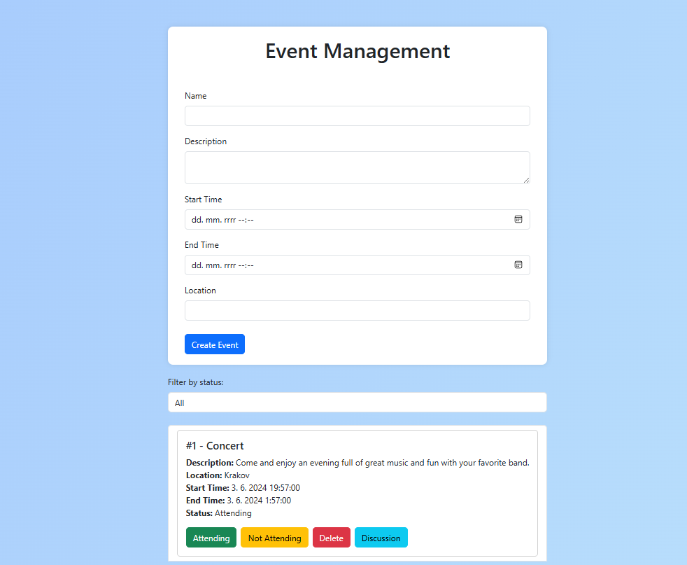

# Event Management App (Part: Frontend)

This is the frontend part of the Event Management application. It is a Single Page Application (SPA) built with React and Bootstrap. This application allows users to create, view, manage events, and engage in discussions related to the events.
For the backend part of this project, visit the [Event Management Backend Repository](https://github.com/TheRIS0/Event-Management-Backend).

## Features
* ***Event Creation and Management:*** Users can create new events with details such as name, description, start and end time, and location.
* ***Attendance Confirmation:*** Users can confirm or decline their attendance for events.
* ***Discussion Platform:*** Each event has a discussion page where users can post comments and engage with other participants.
* ***Emoji Support:*** Users can add emojis to their comments for better expression.
* ***Responsive Design:*** The application is designed to be fully responsive and works seamlessly on various devices.

## Technologies Used
* React: A JavaScript library for building user interfaces.
* React Router: For handling routing within the SPA.
* Axios: For making HTTP requests to the backend API.
* Bootstrap: For responsive and mobile-first web design.
* emoji-mart: A React component library for adding emoji pickers.

## Installation
***Prerequisites:***  Node.js and npm installed on your machine.

## Steps
1. Clone the repository:

```bash
git clone https://github.com/TheRIS0/Event-Management-Frontend.git
cd Event-Management-Frontend
```

2. Install dependencies:

```bash
npm install
```

3. Start the development server:

```bash
npm start
```
The application will be available at `http://localhost:3000`.

## Key Components

* EventForm: A form for creating new events.
* EventList: Displays a list of all events with options to confirm, decline, or delete attendance.
* Discussion: A discussion page for each event where users can post and view comments.

## API Endpoints

The frontend communicates with the backend through the following API endpoints:
*GET /api/events: Fetch all events.
*POST /api/events: Create a new event.
*GET /api/events/
: Fetch details of a single event.
*PUT /api/events/
: Update an event.
*DELETE /api/events/
: Delete an event.
*POST /api/events/
/comments: Post a comment to an event.
*GET /api/events/
/comments: Fetch all comments for an event.
*DELETE /api/events/
/comments/
: Delete a comment.

## Usage 

1. Creating an Event: Navigate to the event creation form, fill in the details, and submit.
2. Confirming or Declining Attendance: Use the buttons next to each event in the event list.
3. Engaging in Discussion: Go to the event's discussion page, type a comment, add emojis, and submit.

## License

This project is licensed under the MIT License. See the [license](license) file for details.
